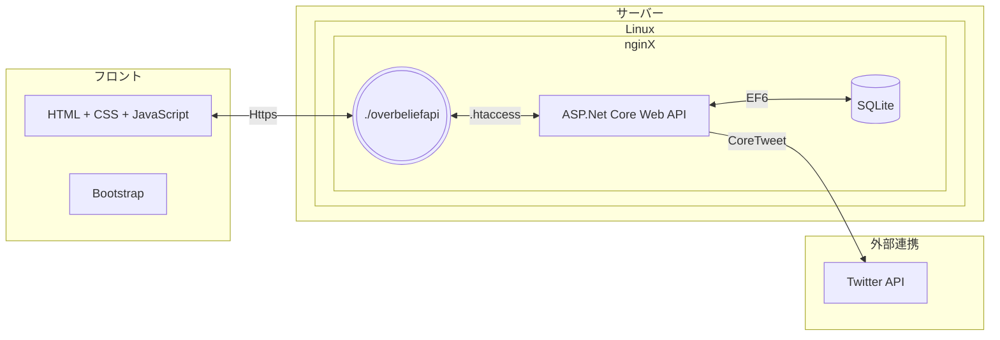
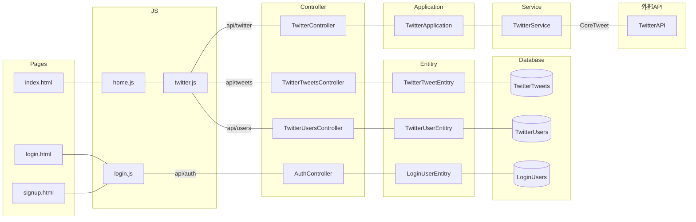

# Over Belief Tool 全体図 <!-- omit in toc -->

- [アプリケーション環境](#アプリケーション環境)
  - [フロント](#フロント)
  - [サーバー](#サーバー)
  - [外部連携](#外部連携)
- [アプリケーション全体図](#アプリケーション全体図)
- [サービス内容](#サービス内容)
  - [プロフィールバナー検索](#プロフィールバナー検索)
  - [ベストツイート検索](#ベストツイート検索)
  - [お気に入りツイート登録](#お気に入りツイート登録)
  - [お気に入りTwitterユーザー登録](#お気に入りtwitterユーザー登録)
  - [ユーザー新規登録・ログイン](#ユーザー新規登録ログイン)
  - [ログ管理（未実装）](#ログ管理未実装)
  - [マイタイムライン（未実装）](#マイタイムライン未実装)
  - [アウトプットログ（未実装）](#アウトプットログ未実装)
  - [アウトプット習慣４２日間チャレンジ（未実装）](#アウトプット習慣４２日間チャレンジ未実装)

## アプリケーション環境

### フロント

- HTML + CSS + JavaScript
- Bootstrap

### サーバー

- Linux nginX
  - WordPress（`https://h1deblog.com/overbeliefapi`)
- App（API）: `ASP.Net Core Web API`（C#）
- Database : `SQLite`

### 外部連携

- Twitter API（CoreTweetを使用）

## アプリケーション全体図

## サービス内容

### プロフィールバナー検索

指定キーワードに基づいたTwitterユーザーのプロフィールバナーを一覧で表示します。  
ユーザーログインしていないくても、使用可能。

### ベストツイート検索

指定したTwitterユーザーの、ツイートを取得し、「いいねが多い順」に表示します。  
ユーザーログインしていないくても、使用可能。

### お気に入りツイート登録

お気に入りのツイートを登録できます。  

登録したツイートへは、以下のことができます。

- ツイートテキストに、メモ書きの追加。
- タグを設定することで、ツイートごとの分類を行う。

### お気に入りTwitterユーザー登録

お気に入りのTwitterユーザーを登録できます。  

登録したTwitterユーザーへは、以下のことができます。

- ベストツイート検索のユーザー指定候補として、画面にボタンが表示される。
- タグを設定することで、ユーザーごとの分類を行う。（未実装）

### ユーザー新規登録・ログイン

ユーザー登録、ログインを行います。

ログイン方法は、以下の2種類です。

- 画面からメールアドレス・パスワードを入力することでログインする。
- ユーザーごとに作成されたパスコードによって、ページアクセス時に自動ログインを行う。

### ログ管理（未実装）

API接続時に、アクション内容をデータベースへ出力します。

### マイタイムライン（未実装）

指定Twitterユーザーのタイムラインを表示します。

表示は、「お気に入りTwitterユーザー登録」で登録した「分類」に紐づくユーザーです。

### アウトプットログ（未実装）

・目的：アウトプットした日を記録することで、継続的にアウトプットする習慣をつくる。  
・対象：ツイート、メルマガへの返信、ブログ記事、メルマガ  
・機能：自身のツイート数をTwitterAPIから取得。その他、ブログやメルマガは、自分でアウトプットしたことを入力。  

### アウトプット習慣４２日間チャレンジ（未実装）

・目的：42日間毎日なんらかのアウトプットをすることを促す機能。  
・対象：アウトプットログと同じ。
